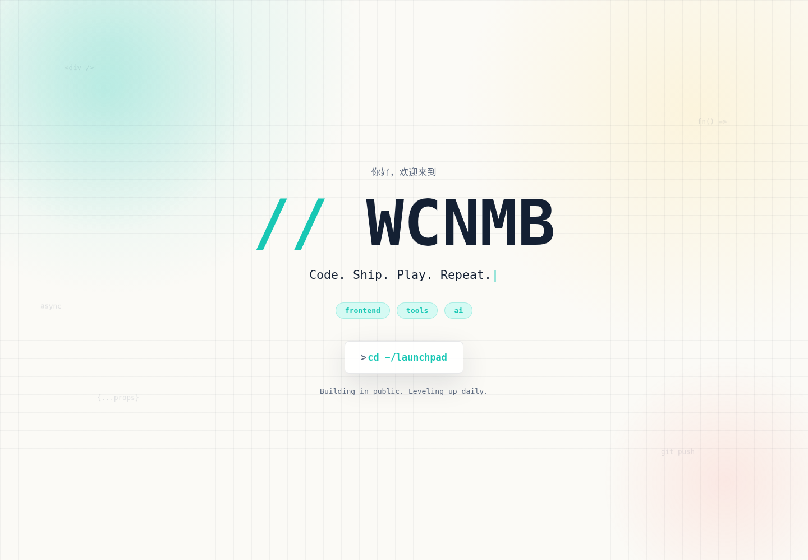
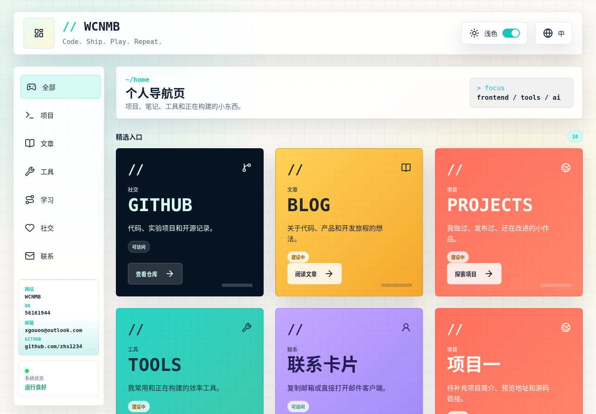

# WCNMB

个人开发者导航页，用来整理项目、笔记、工具和学习资源。React 19 + Vite，支持分类筛选、中英切换和明暗主题。

[在线演示](https://show.wcnmb.top/) · 点击欢迎页的 `cd ~/launchpad` 进入导航。

## 预览

线上截图，2026-09-30。





## 本地运行

需要 Node.js 22.12+（或 20.19+）和 npm。在仓库根目录运行：

```bash
npm install
npm run dev
```

访问 `http://127.0.0.1:5173`。

```bash
npm run build    # 输出到 dist/
npm run preview  # 预览构建结果
```

## 修改内容

| 文件 | 内容 |
| --- | --- |
| [`src/data/profile.js`](./src/data/profile.js) | 品牌名、联系方式、焦点标签；`focus` 用 ` / ` 分隔 |
| [`src/data/links.js`](./src/data/links.js) | 导航链接、分类和卡片文案 |
| [`src/data/i18n.js`](./src/data/i18n.js) | 中英文文案，包括欢迎语和进入按钮 |
| [`src/styles.css`](./src/styles.css) | 布局与主题；颜色变量在 `:root` 和 `[data-theme="dark"]` 中 |

新增链接可复制 `links.js` 中的条目。字段、分类值和部署配置见[配置说明](./docs/configuration.md)。

## 部署

运行 `npm run build`，把 `dist/` 的内容放到静态站点目录。Vercel / Netlify 的构建命令同上，输出目录填 `dist`。

Nginx 需配置路由回退，完整示例见[配置说明](./docs/configuration.md)：

```nginx
location / {
    try_files $uri $uri/ /index.html;
}
```

## 许可

MIT
